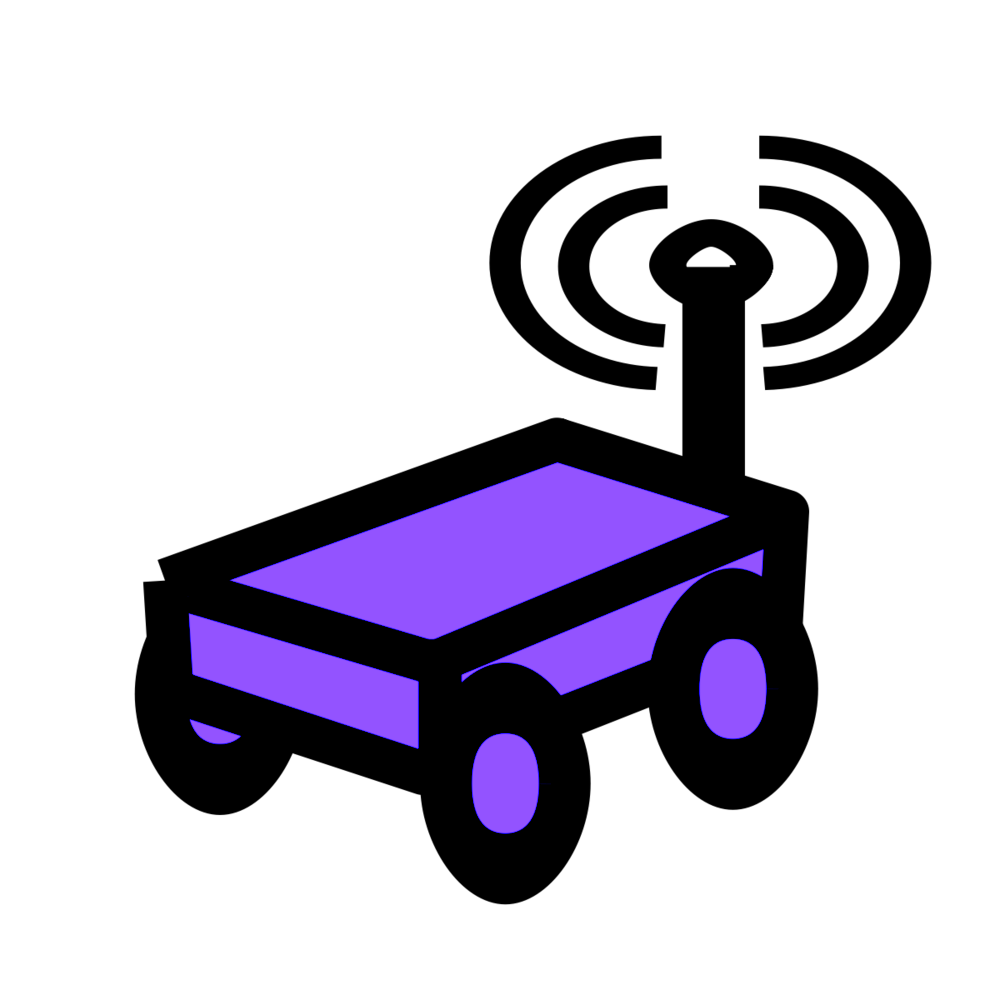

# StereoRobot

<div id="top"></div>


<!-- PROJECT LOGO -->
<br />
<div align="center">
  <a href="https://github.com/nickthorpie/StereoRobot">
    
  </a>

<h3 align="center">StereoRobot</h3>

  <p align="center">
    Autonomous navigation using a stereo camera
    <br />
    <a href="https://github.com/nickthorpie/StereoRobot/resources/MECH_460_Final_Report_Team_03.pdf"><strong>Explore the Paper »</strong></a>
    <br />
    <a href="https://github.com/nickthorpie/StereoRobot">Report Bug</a>
    ·
    <a href="https://github.com/nickthorpie/StereoRobot/issues">Request Feature</a>
  </p>
</div>


<!-- TABLE OF CONTENTS -->
<details>
  <summary>Table of Contents</summary>
  <ol>
    <li>
      <a href="#about-the-project">About The Project</a>
      <ul>
        <li><a href="#built-with">Built With</a></li>
      </ul>
    </li>
    <li>
      <a href="#getting-started">Getting Started</a>
      <ul>
        <li><a href="#prerequisites">Prerequisites</a></li>
        <li><a href="#installation">Installation</a></li>
      </ul>
    </li>
    <li><a href="#usage">Usage</a></li>
    <li><a href="#roadmap">Roadmap</a></li>
    <li><a href="#contributing">Contributing</a></li>
    <li><a href="#license">License</a></li>
    <li><a href="#contact">Contact</a></li>
    <li><a href="#acknowledgments">Acknowledgments</a></li>
  </ol>
</details>


<!-- ABOUT THE PROJECT -->
## About The Project

[![Product Name Screen Shot][product-screenshot]](https://pybullet.org/wordpress/)

This project is the backend for an autonomous warehouse solution built for [SigmaPoint](https://www.sigmapoint.com). 
This project uses a stereo depth camera connected to an NVIDIA Jetson Nano to perform object detection,
line following, and QR code scanning. See the paper linked at the top to learn more about the design.

To minimize the time between robot assembly and software implementation, this project uses PyBullet to trial the software
in a simulated environment.


<p align="right">(<a href="#top">back to top</a>)</p>


<!-- GETTING STARTED -->
## Getting Started

This is an example of how you may give instructions on setting up your project locally.
To get a local copy up and running follow these simple example steps.

### Prerequisites

This is an example of how to list things you need to use the software and how to install them.
* python == 3.8
  ```sh
  conda env -n StereoRobot python=3.8
  conda activate StereoRobot
  ```
* pyBullet
  ```sh
  pip install pybullet
  ```
* OpenCV
  ```
  pip install opencv-python
  ```

### Installation

Clone the repo
   ```sh
   git clone https://github.com/nickthorpie/StereoRobot.git
   ```


<!-- USAGE EXAMPLES -->
## Usage

Use this space to show useful examples of how a project can be used. Additional screenshots, code examples and demos work well in this space. You may also link to more resources.


<p align="right">(<a href="#top">back to top</a>)</p>


<!-- ROADMAP -->
## Roadmap

- [x] Simulation
    - [x] Create PyBullet Simulation
    - [x] Create virtual connections (motor control, camera reading)
- [ ] Camera Processing
    - [ ] Line identification
    - [ ] Blob detection
    - [ ] QR Reader
- [ ] Global Navigation
    - [ ] Node Container
    - [ ] A*
- [ ] Local Navigation
    - [ ] Vector Force Field
- [ ] GUI
    - [ ] Camera Processing Sliders
    - [ ] Vect Force Field Calibration
    - [ ] Connected Nodes
    

See the [open issues](https://github.com/nickthorpie/StereoRobot/issues) for a full list of proposed features (and known issues).

<p align="right">(<a href="#top">back to top</a>)</p>


<!-- CONTRIBUTING -->
## Contributing

Contributions are what make the open source community such an amazing place to learn, inspire, and create. Any contributions you make are **greatly appreciated**.

If you have a suggestion that would make this better, please fork the repo and create a pull request. You can also simply open an issue with the tag "enhancement".
Don't forget to give the project a star! Thanks again!

1. Fork the Project
2. Create your Feature Branch (`git checkout -b feature/AmazingFeature`)
3. Commit your Changes (`git commit -m 'Add some AmazingFeature'`)
4. Push to the Branch (`git push origin feature/AmazingFeature`)
5. Open a Pull Request

<p align="right">(<a href="#top">back to top</a>)</p>


<!-- LICENSE -->
## License

Distributed under the MIT License. See `LICENSE.txt` for more information.

<p align="right">(<a href="#top">back to top</a>)</p>


<!-- CONTACT -->
## Contact

Nick Thorpe -  - 16njft@queensu.ca

Project Link: [https://github.com/nickthorpie/StereoRobot](https://github.com/nickthorpie/StereoRobot)

<p align="right">(<a href="#top">back to top</a>)</p>


<!-- ACKNOWLEDGMENTS -->
## Acknowledgments

* []()
* []()
* []()

<p align="right">(<a href="#top">back to top</a>)</p>


<!-- MARKDOWN LINKS & IMAGES -->
<!-- https://www.markdownguide.org/basic-syntax/#reference-style-links -->
[contributors-shield]: https://img.shields.io/github/contributors/nickthorpie/StereoRobot.svg?style=for-the-badge
[contributors-url]: https://github.com/nickthorpie/StereoRobot/graphs/contributors
[forks-shield]: https://img.shields.io/github/forks/nickthorpie/StereoRobot.svg?style=for-the-badge
[forks-url]: https://github.com/nickthorpie/StereoRobot/network/members
[stars-shield]: https://img.shields.io/github/stars/nickthorpie/StereoRobot.svg?style=for-the-badge
[stars-url]: https://github.com/nickthorpie/StereoRobot/stargazers
[issues-shield]: https://img.shields.io/github/issues/nickthorpie/StereoRobot.svg?style=for-the-badge
[issues-url]: https://github.com/nickthorpie/StereoRobot/issues
[license-shield]: https://img.shields.io/github/license/nickthorpie/StereoRobot.svg?style=for-the-badge
[license-url]: https://github.com/nickthorpie/StereoRobot/blob/master/LICENSE.txt
[linkedin-shield]: https://img.shields.io/badge/-LinkedIn-black.svg?style=for-the-badge&logo=linkedin&colorB=555
[linkedin-url]: https://linkedin.com/in/linkedin_username
[product-screenshot]: resources/readme/pybulletscreencap.png